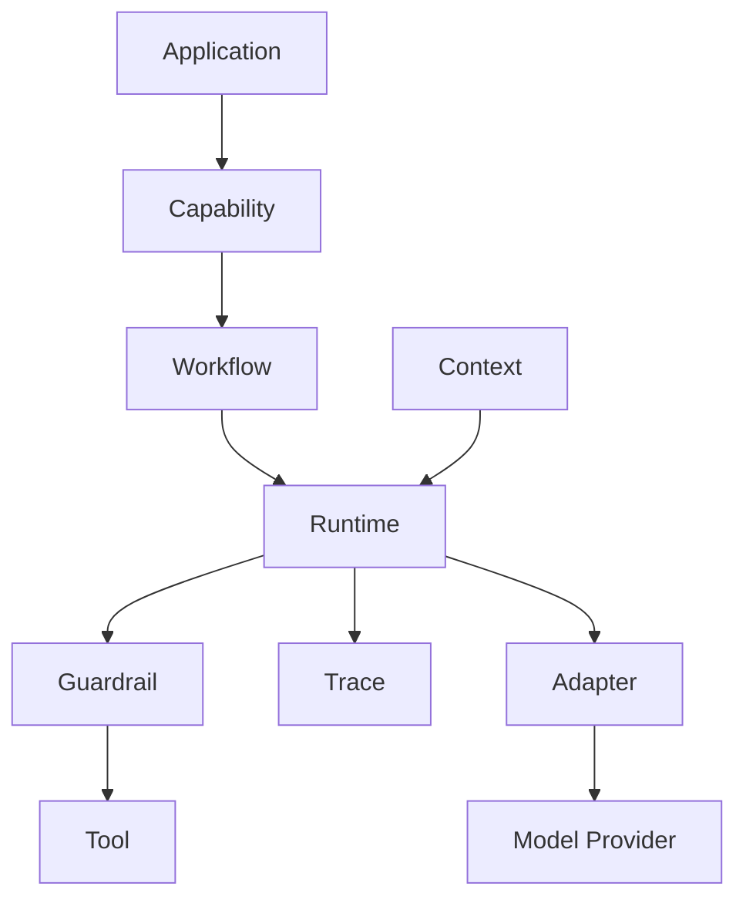

# Architecture

## Layer responsibilities

| Layer | Responsibility |
| --- | --- |
| Tool | Defines executable actions |
| Runtime | Executes tools safely |
| Context | Provides immutable execution input |
| Capability | Groups tools by user-facing ability |
| Workflow | Coordinates multi-step execution |
| Adapter | Normalizes model providers |
| Guardrail | Enforces policy |
| Trace | Records lifecycle events |
